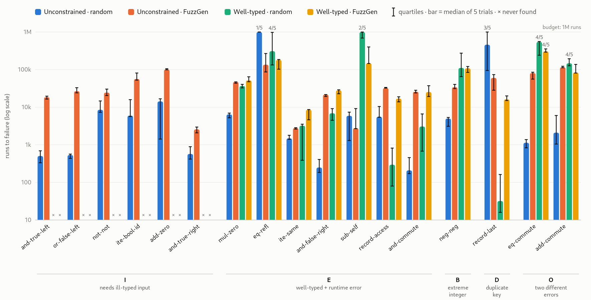

# MiniCedar optimizer experiment: unconstrained vs well-typed generation, random vs FuzzGen

17 planted unsound optimizer rules (`BasaltFuzz/MiniCedar/Optimize.lean`, `plantedRules`) run
against `prop_optimize_sound` (`BasaltFuzz/MiniCedar/Props.lean`). There are four arms:
- the generator is `genAnyExpr` (`mc-bug-*`) or `genValidExpr` (`mcv-bug-*`);
- the backend is `io` (random) or `fuzz` (`FuzzGen`).

Each arm ran 5 trials per bug, capped at 1M runs.



## Files

- `results-A-V.csv` holds the raw results. Columns: `bug,gen,backend,trial,found,runs,typed`,
  where `typed` says whether the counterexample was well-typed.
- `mkjobs.sh` prints the job list, and `one.sh BUG GEN BACKEND TRIAL` runs one job and prints one
  CSV row.
- `summ.py` prints the summary table.
- `chart.py` writes `chart.html` (interactive, with a table view) and `chart-light.svg`:
  - bar = median of the trials;
  - whiskers = quartiles;
  - a trial that found nothing counts as 1M runs.

## Reproducing

From the repository root:

```sh
fuzz-run/build.sh
bash experiments/minicedar/mkjobs.sh > /tmp/jobs.txt
xargs -P6 -L1 experiments/minicedar/one.sh < /tmp/jobs.txt > experiments/minicedar/results-A-V.csv
python3 experiments/minicedar/summ.py
python3 experiments/minicedar/chart.py
python3 -c "import cairosvg; cairosvg.svg2png(url='experiments/minicedar/chart-light.svg', \
  write_to='experiments/minicedar/chart-light.png', output_width=1770)"
```

The counts are runs, not time. `FuzzGen` does about 20k runs/s here and `io` about 31–40k/s.
